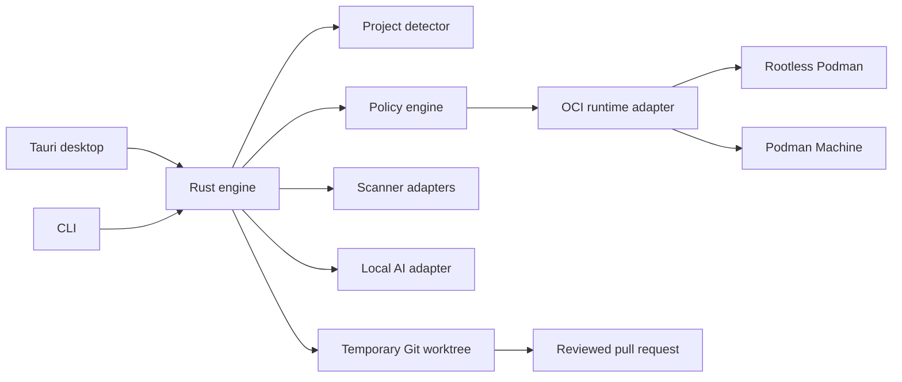

# LaunchGuard

[](https://github.com/bananatruck/launchguard/actions/workflows/docs.yml)
[](https://github.com/bananatruck/launchguard/actions/workflows/rust.yml)

**A local-first deployment intelligence platform for unfinished software
projects.**

> [!IMPORTANT]
> Phases 1 and 2 audit and plan only. LaunchGuard reports what trusted scanners
> found and what it proposes to run. It does not build, test, install, repair,
> or deploy repository code, and it never claims a project is secure.

LaunchGuard will inspect a local repository or GitHub URL, determine how the
project is built, normalize security findings, test it in an isolated
environment, use optional local AI to diagnose failures, and generate a
reviewable deployment pull request.

It follows one gated pipeline:

```text
Detect → Scan → Plan → Approve → Build → Test → Explain → Repair → Verify → Publish
```

LaunchGuard is not an unattended production deployment service. Its most
privileged v1 outcome is a user-approved pull request containing tested
deployment configuration.

## Product principles

- **Deterministic evidence first.** Manifests, scanners, tests, and health
  checks are authoritative. AI is an explanation and remediation layer.
- **Local and free by default.** Core analysis, local inference, and preview do
  not require a paid API or subscription.
- **Constrained autonomy.** The engine may iterate inside an approved sandbox,
  but it cannot approve commands, credentials, publication, or paid resources.
- **No unknown code on the host.** Builds execute through a rootless OCI
  runtime using a staged workspace and explicit resource policy.
- **Everything is reviewable.** Commands, generated files, findings, model
  proposals, and verification results are included in an audit record.

## V1 capability

The first working release is designed for Linux, macOS, and Windows and
supports:

- React/Vite static applications.
- Next.js applications with explicit static or server classification.
- FastAPI services.
- Rust Axum services.
- Trivy and OSV-Scanner findings normalized into one schema.
- Rootless Podman on Linux and Podman Machine on macOS and Windows.
- Optional local inference through Ollama.
- Local preview, health checks, bounded repair attempts, and GitHub pull
  request generation.
- Cloudflare Pages and Render configuration generation.

Direct infrastructure provisioning, Kubernetes, Terraform, arbitrary
monorepos, and guaranteed execution of deliberately hostile code are not v1
features.

## Planned architecture



The Rust engine is interface-agnostic. Tauri and the CLI consume the same
typed events and operations rather than implementing separate workflows.

## Quick start

LaunchGuard requires Rust 1.97.1. The repository pins the toolchain and commits
its dependency lockfile. Trivy and OSV-Scanner are optional; a missing scanner
degrades coverage instead of failing the run.

```bash
cargo build --locked
cargo run --locked -- audit ./path/to/project --format json
cargo run --locked -- audit ./path/to/project --scanner trivy --scanner osv-scanner
cargo run --locked -- audit https://github.com/owner/public-repository
cargo run --locked -- plan ./path/to/project --format markdown
cargo run --locked -- history
cargo run --locked -- status <run-id> --format markdown
cargo run --locked -- schema execution-plan
```

The `audit` command:

- Accepts a local directory or root URL for a public GitHub repository.
- Detects React/Vite, Next.js, FastAPI, and Rust/Axum.
- Reports competing supported classifications as `needs_confirmation`.
- Runs the trusted scanners you select, without a shell and with bounded output.
- Normalizes findings into one schema with stable, scanner-neutral fingerprints.
- Keeps raw scanner reports in a private, content-addressed local store.
- Generates a content-addressed execution plan that requires approval.
- Scores readiness deterministically, with no model involved.
- Records the whole run in SQLite unless `--no-history` is used.
- Writes structured diagnostics to standard error, preserving JSON on standard
  output.

The `plan` command generates and prints a reviewed execution plan without
running scanners or project code.

Set `LAUNCHGUARD_DATABASE` or pass `--database` to choose the history file, and
`LAUNCHGUARD_TRIVY` or `LAUNCHGUARD_OSV_SCANNER` to pin scanner executables.
Only environment variable names are collected; values from `.env` files are
never read.

See the [Phase 1](docs/PHASE_1.md) and [Phase 2](docs/PHASE_2.md)
implementation guides for detector contracts, scanner behavior, plan templates,
scoring, limits, and known limitations.

## Autonomy boundary

| Operation | Automatic | Approval required |
| --- | --- | --- |
| Read-only detection and scanning | Yes | No |
| Generate a command plan | Yes | No |
| Execute commands in a restricted preview | After plan approval | Once per plan |
| Retry verified repairs | Up to three attempts | Covered by approved plan |
| Enable package-registry network access | No | Yes |
| Modify the original checkout | No | Yes |
| Push a branch or open a pull request | No | Yes |
| Read credentials or provision infrastructure | No | Always |

See the full [product specification](docs/SPECIFICATION.md) and
[security model](docs/SECURITY_MODEL.md).

## What “free” means

LaunchGuard is intended to have zero mandatory software, inference, API, or
hosting spend for local audit and preview. This does not include hardware,
electricity, domains, code-signing certificates, paid cloud resources, or
provider usage beyond free-tier limits.

Users supply their own provider accounts and credentials. A deployment adapter
must display cost and free-tier limitations; it may never label an unknown
provider operation as free.

The detailed contract is in
[System requirements and cost model](docs/SYSTEM_REQUIREMENTS.md).

## Documentation

- [Product specification](docs/SPECIFICATION.md)
- [Security model](docs/SECURITY_MODEL.md)
- [System requirements and cost model](docs/SYSTEM_REQUIREMENTS.md)
- [Roadmap](docs/ROADMAP.md)
- [Phase 1 implementation](docs/PHASE_1.md)
- [Phase 2 implementation](docs/PHASE_2.md)
- [Phase 3 design](docs/PHASE_3.md)
- [ProjectProfile v1 JSON Schema](schemas/project-profile-v1.schema.json)
- [Finding v1 JSON Schema](schemas/finding-v1.schema.json)
- [ExecutionPlan v1 JSON Schema](schemas/execution-plan-v1.schema.json)
- [ReadinessAssessment v1 JSON Schema](schemas/readiness-assessment-v1.schema.json)
- [Degradation v1 JSON Schema](schemas/degradation-v1.schema.json)
- [Contributing](CONTRIBUTING.md)

## Status

Phases 1 and 2 are complete.

Phase 1 classified 40 of 40 supported fixtures correctly and failed closed on
all seven safety fixtures. See the
[Phase 1 evaluation report](docs/evaluation/phase-1.md).

Phase 2 produced a schema-valid execution plan for 40 of 40 supported fixtures
with Trivy 0.72.0 and OSV-Scanner 2.4.0 running for real, reproduced every plan
and assessment digest across repeated runs, and refused to plan an ambiguous
project. See the [Phase 2 evaluation report](docs/evaluation/phase-2.md) for
the environment, raw counts, smoke checks, the four defects that real scanner
runs exposed, and limitations.

Phase 3 distribution and capability discovery is next. See the
[Phase 3 design](docs/PHASE_3.md).

The roadmap was reordered after Phase 2: the deployment path now precedes
isolated preview, because provider build systems compile from source, so local
execution verifies a deployment rather than being required to produce one.
Gating the whole product on the heaviest prerequisite would have made the
deterministic security work unreachable for most users.

No LaunchGuard release has yet executed a project command.

## License

LaunchGuard is licensed under the [MIT License](LICENSE). Third-party scanners,
rules, local models, container runtimes, and deployment providers retain their
own licenses and terms.
