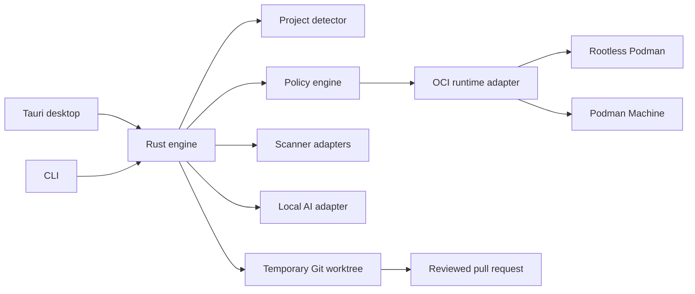

# LaunchGuard

[](https://github.com/bananatruck/launchguard/actions/workflows/docs.yml)

**A local-first deployment intelligence platform for unfinished software
projects.**

> [!IMPORTANT]
> LaunchGuard is currently a pre-implementation specification. The repository
> defines the product contract and safety boundaries before executable code is
> introduced.

LaunchGuard will inspect a local repository or GitHub URL, determine how the
project is built, normalize security findings, test it in an isolated
environment, use optional local AI to diagnose failures, and generate a
reviewable deployment pull request.

It follows one gated pipeline:

```text
Detect → Scan → Plan → Approve → Build → Test → Explain → Repair → Verify → Publish
```

LaunchGuard is not an unattended production deployment service. Its most
privileged v1 outcome is a user-approved pull request containing tested
deployment configuration.

## Product principles

- **Deterministic evidence first.** Manifests, scanners, tests, and health
  checks are authoritative. AI is an explanation and remediation layer.
- **Local and free by default.** Core analysis, local inference, and preview do
  not require a paid API or subscription.
- **Constrained autonomy.** The engine may iterate inside an approved sandbox,
  but it cannot approve commands, credentials, publication, or paid resources.
- **No unknown code on the host.** Builds execute through a rootless OCI
  runtime using a staged workspace and explicit resource policy.
- **Everything is reviewable.** Commands, generated files, findings, model
  proposals, and verification results are included in an audit record.

## V1 capability

The first working release is designed for Linux, macOS, and Windows and
supports:

- React/Vite static applications.
- Next.js applications with explicit static or server classification.
- FastAPI services.
- Rust Axum services.
- Trivy and OSV-Scanner findings normalized into one schema.
- Rootless Podman on Linux and Podman Machine on macOS and Windows.
- Optional local inference through Ollama.
- Local preview, health checks, bounded repair attempts, and GitHub pull
  request generation.
- Cloudflare Pages and Render configuration generation.

Direct infrastructure provisioning, Kubernetes, Terraform, arbitrary
monorepos, and guaranteed execution of deliberately hostile code are not v1
features.

## Planned architecture



The Rust engine is interface-agnostic. Tauri and the CLI consume the same
typed events and operations rather than implementing separate workflows.

## Autonomy boundary

| Operation | Automatic | Approval required |
| --- | --- | --- |
| Read-only detection and scanning | Yes | No |
| Generate a command plan | Yes | No |
| Execute commands in a restricted preview | After plan approval | Once per plan |
| Retry verified repairs | Up to three attempts | Covered by approved plan |
| Enable package-registry network access | No | Yes |
| Modify the original checkout | No | Yes |
| Push a branch or open a pull request | No | Yes |
| Read credentials or provision infrastructure | No | Always |

See the full [product specification](docs/SPECIFICATION.md) and
[security model](docs/SECURITY_MODEL.md).

## What “free” means

LaunchGuard is intended to have zero mandatory software, inference, API, or
hosting spend for local audit and preview. This does not include hardware,
electricity, domains, code-signing certificates, paid cloud resources, or
provider usage beyond free-tier limits.

Users supply their own provider accounts and credentials. A deployment adapter
must display cost and free-tier limitations; it may never label an unknown
provider operation as free.

The detailed contract is in
[System requirements and cost model](docs/SYSTEM_REQUIREMENTS.md).

## Documentation

- [Product specification](docs/SPECIFICATION.md)
- [Security model](docs/SECURITY_MODEL.md)
- [System requirements and cost model](docs/SYSTEM_REQUIREMENTS.md)
- [Roadmap](docs/ROADMAP.md)
- [Contributing](CONTRIBUTING.md)

## Status

The next milestone is a Rust engine and CLI skeleton implementing read-only
project detection. No current release should be represented as a security
product or deployment automation tool.

## License

LaunchGuard is licensed under the [MIT License](LICENSE). Third-party scanners,
rules, local models, container runtimes, and deployment providers retain their
own licenses and terms.
