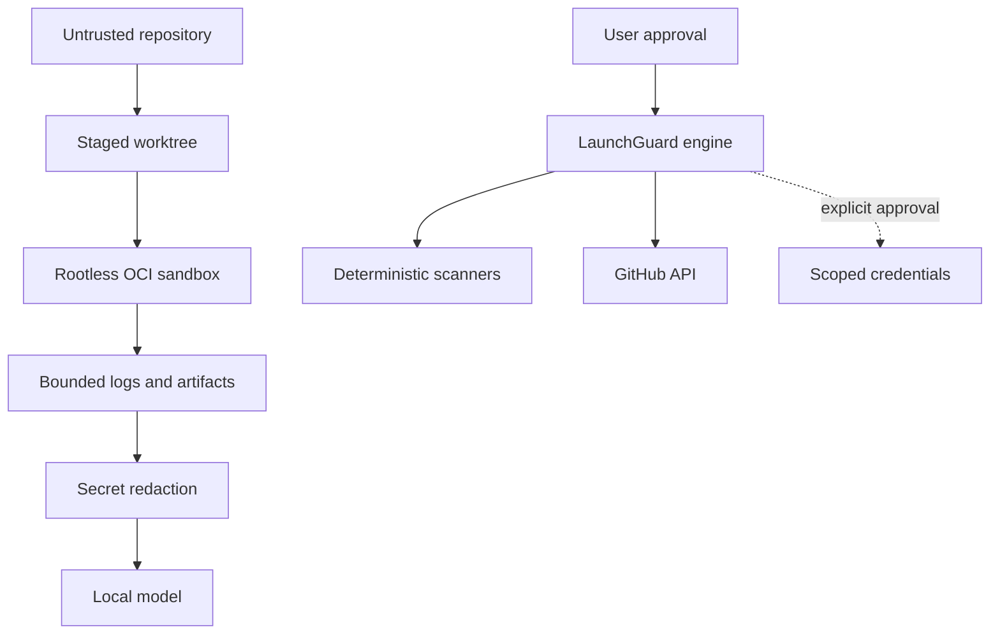

# LaunchGuard Security Model

## Purpose

LaunchGuard reduces the risk of inspecting and building unfamiliar software.
It does not promise that containers make deliberately hostile code safe.

This document defines v1 trust boundaries and the minimum controls required
before Preview or Repair may be described as isolated.

## Assets to protect

- Host files outside the staged workspace.
- SSH keys, Git credentials, cloud credentials, tokens, and environment
  secrets.
- Container-runtime control sockets.
- Other processes and local network services.
- Repository integrity and Git history.
- Provider accounts and billable resources.
- Scanner, model, and deployment audit records.

## Adversary model

LaunchGuard must account for:

- Accidental destructive scripts.
- Compromised dependencies and lifecycle hooks.
- Malicious repository content intended to influence the local model.
- Prompt injection in source files, logs, issues, and documentation.
- Secrets committed to or reachable from the repository.
- Build processes attempting host, local-network, or cloud-metadata access.
- Resource exhaustion, fork bombs, oversized output, and long-running builds.
- Generated deployment configuration that exposes services or incurs cost.

V1 is not a hardened malware-analysis environment. Repositories suspected of
intentional kernel exploitation require a disposable, externally managed VM
and are outside the supported threat model.

## Trust boundaries

Repository text, project processes, dependencies, build logs, scanner output,
and model output are untrusted inputs.

## Required execution controls

Preview and Repair must use:

- Rootless Podman on Linux or a Podman Machine VM on macOS and Windows.
- A staged copy or temporary Git worktree rather than the original checkout.
- A non-root container user.
- No privileged mode.
- No host PID, IPC, or network namespace.
- No container-runtime socket.
- No inherited SSH agent, credential store, cloud configuration, or arbitrary
  host environment.
- Read-only base mounts and an explicit temporary writable workspace.
- CPU, memory, PID, output-size, and wall-clock limits.
- Capability removal, `no-new-privileges`, and a maintained seccomp profile.
- Network disabled by default.
- Destination and protocol restrictions when network is approved.
- Explicit cleanup with persistent identifiers when cleanup fails.

The engine must show these controls in the `ExecutionPlan`; hidden defaults are
not sufficient for approval.

## Network policy

Audit and the initial Preview environment have no project network access.

If dependency installation requires a registry, LaunchGuard must present:

- Requested hostnames and ports.
- The command requiring access.
- Whether package lifecycle scripts may run.
- The duration of the grant.
- Cache and artifact implications.

Approval grants only the displayed policy. Access to loopback host services,
RFC 1918 networks, link-local addresses, and cloud metadata endpoints remains
blocked unless a future specification introduces a narrower reviewed use case.

## Command policy

The engine represents commands as executable plus argument arrays. It must not
pass model-generated text to a shell.

Commands are accepted only when derived from reviewed templates, explicit
repository scripts, user input, or a visibly labeled model proposal that
passes policy validation. Shell operators, substitutions, redirections, and
interpreter escape hatches require separate review.

The command plan is content-addressed. Changing a command, mount, environment
entry, limit, or network rule invalidates approval.

## AI and prompt-injection controls

Source files and logs may contain instructions aimed at the model. They are
data, never policy.

- System policy is compiled into the engine and cannot be overridden by
  repository text.
- Model tools expose typed proposals, not unrestricted execution.
- Prompts receive redacted, size-bounded excerpts with source labels.
- Model output must pass schema, path, command, and diff validation.
- AI cannot change findings, scores, approvals, credentials, or network rules.
- Every model-influenced mutation is labeled in the final report.

## Secrets and credentials

Secrets discovered during scanning must be redacted from UI events, logs,
model prompts, and reports by default.

Provider credentials:

- Are requested only at publication time.
- Use provider-native secure storage when possible.
- Must be narrowly scoped and short lived when supported.
- Are injected only into the specific adapter process.
- Never enter the project sandbox or model context.
- Must not be written to the repository, SQLite history, or deployment record.

## Git safety

Repairs occur in a temporary worktree on a LaunchGuard-owned branch. The engine
must not rewrite existing commits, force-push, delete branches, or modify the
user's original worktree.

Before publication, the user receives:

- Complete diff.
- Generated-file inventory.
- Findings delta.
- Test and health results.
- Unresolved blockers.
- Requested repository permissions.

Publication requires explicit approval distinct from Preview approval.

## Provider safety

V1 does not provision resources. Generated manifests must be validated locally
where a provider-supported validator is available.

Every adapter must describe:

- Resources the configuration would create.
- Required secrets.
- Free-tier and persistence limitations.
- Potential paid usage.
- Rollback or removal procedure.

Unknown cost is shown as unknown, never zero.

## Security claims LaunchGuard may make

LaunchGuard may report that:

- A specified scanner completed against a specified database version.
- A restricted preview passed documented isolation fixtures.
- Tests and health checks passed in a particular environment.
- A generated artifact has a recorded digest.
- No findings of a given category were reported by the enabled scanners.

LaunchGuard must not claim that:

- A repository is secure.
- A container is equivalent to a hostile-code VM sandbox.
- Absence of scanner findings proves absence of vulnerabilities or secrets.
- AI remediation is correct without deterministic verification.
- A deployment is production ready solely because its score is high.

## Security validation

The implementation test corpus must include fixtures attempting:

- Host filesystem traversal.
- Runtime socket access.
- SSH and cloud credential access.
- Localhost, private-network, DNS-rebinding, and metadata-service access.
- Environment-variable exfiltration.
- Privilege escalation and capability use.
- Fork bombs, memory exhaustion, excessive logs, and timeouts.
- Prompt injection requesting policy changes.
- Patch writes outside the temporary worktree.
- Publication without approval.

All blocked operations must fail closed and leave an auditable result.

## Vulnerability reporting

Until executable code exists, use private GitHub security advisories for
documentation flaws that could lead to an unsafe implementation. Do not place
real credentials, exploit payloads, or private repository contents in a public
issue.
